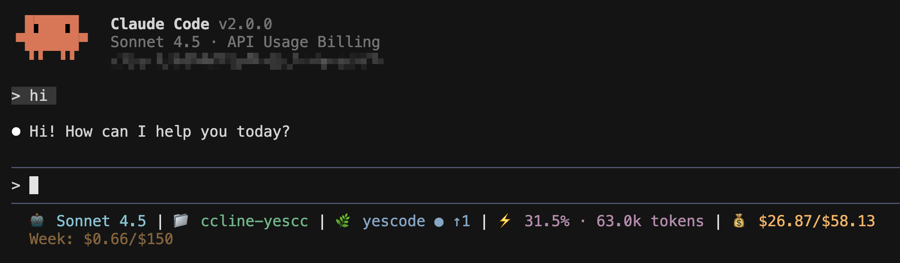

# CCometixLine-YesCC

[English](README.md) | [中文](README.zh.md)

基于 Rust 的高性能 Claude Code 状态栏工具，集成 Git 信息、使用量跟踪、交互式 TUI 配置、API 配额监控和 Claude Code 增强工具。

> **由 [HoBeedzc](https://github.com/HoBeedzc) 维护** - 这是专为 YesCode 服务特别适配的 CCometixLine 版本。原始 CCometixLine 由 [Haleclipse](https://github.com/Haleclipse/CCometixLine) 在 MIT 许可证下创建。本项目同样在 MIT 许可证下发布。
>
> 本项目还整合了另一个 MIT 许可证项目 [ccline-packycc](https://github.com/ding113/ccline-packycc) 的代码，并保留了相应归属。
>
> YesCode 是第三方 Claude Code 代理服务。本项目是自发的第三方适配，与 Anthropic 或 YesCode 无关。YesCode 网站：[yescode](https://co.yes.vg/)。本项目实现了对两个端点的自动适配。


[](https://github.com/HoBeedzc/ccline-yescc/actions/workflows/ci.yml)

## 截图



状态栏显示：模型 | 目录 | Git 分支状态 | 上下文窗口 | API 配额

## 特性

### 核心功能
- **Git 集成** 显示分支、状态和跟踪信息
- **模型显示** 简化的 Claude 模型名称
- **使用量跟踪** 基于转录文件分析
- **目录显示** 显示当前工作空间
- **API 配额显示** 显示当前 API 配额
- **简洁设计** 使用 Nerd Font 图标

### 交互式 TUI 功能
- **交互式主菜单** 无输入时直接执行显示菜单
- **TUI 配置界面** 实时预览配置效果
- **主题系统** 多种内置预设主题
- **段落自定义** 精细化控制各段落
- **配置管理** 初始化、检查、编辑配置

### Claude Code 增强
- **禁用上下文警告** 移除烦人的"Context low"消息
- **启用详细模式** 增强输出详细信息
- **稳定补丁器** 适应 Claude Code 版本更新
- **自动备份** 安全修改，支持轻松恢复

## 安装

### 快速安装（推荐）

通过 npm 安装（适用于所有平台）：

```bash
# 全局安装
npm install -g @hobeeliu/ccline-yescc

# 或使用 yarn
yarn global add @hobeeliu/ccline-yescc

# 或使用 pnpm
pnpm add -g @hobeeliu/ccline-yescc
```

使用镜像源加速下载：
```bash
npm install -g @hobeeliu/ccline-yescc --registry https://registry.npmmirror.com
```

安装后：
- ✅ 全局命令 `ccline-yescc` 可在任何地方使用
- ⚙️ 按照下方提示进行配置以集成到 Claude Code
- 🎨 运行 `ccline-yescc -c` 打开配置面板进行主题选择

### Claude Code 配置

添加到 Claude Code `settings.json`：

**Linux/macOS:**
```json
{
  "statusLine": {
    "type": "command", 
    "command": "~/.claude/ccline/ccline-yescc",
    "padding": 0
  }
}
```

**Windows:**
```json
{
  "statusLine": {
    "type": "command", 
    "command": "%USERPROFILE%\\.claude\\ccline\\ccline-yescc.exe",
    "padding": 0
  }
}
```

**后备方案 (npm 安装):**
```json
{
  "statusLine": {
    "type": "command", 
    "command": "ccline-yescc",
    "padding": 0
  }
}
```
*如果 npm 全局安装已在 PATH 中可用，则使用此配置*

### 更新

```bash
npm update -g @hobeeliu/ccline-yescc
```

<details>
<summary>手动安装（点击展开）</summary>

或者从 [Releases](https://github.com/HoBeedzc/ccline-yescc/releases) 手动下载：

#### Linux

#### 选项 1: 动态链接版本（推荐）
```bash
mkdir -p ~/.claude/ccline
wget https://github.com/HoBeedzc/ccline-yescc/releases/latest/download/ccline-yescc-linux-x64.tar.gz
tar -xzf ccline-yescc-linux-x64.tar.gz
cp ccline-yescc ~/.claude/ccline/
chmod +x ~/.claude/ccline/ccline-yescc
```
*系统要求: Ubuntu 22.04+, CentOS 9+, Debian 11+, RHEL 9+ (glibc 2.35+)*

#### 选项 2: 静态链接版本（通用兼容）
```bash
mkdir -p ~/.claude/ccline
wget https://github.com/HoBeedzc/ccline-yescc/releases/latest/download/ccline-yescc-linux-x64-static.tar.gz
tar -xzf ccline-yescc-linux-x64-static.tar.gz
cp ccline-yescc ~/.claude/ccline/
chmod +x ~/.claude/ccline/ccline-yescc
```
*适用于任何 Linux 发行版（静态链接，无依赖）*

#### macOS (Intel)

```bash  
mkdir -p ~/.claude/ccline
wget https://github.com/HoBeedzc/ccline-yescc/releases/latest/download/ccline-yescc-macos-x64.tar.gz
tar -xzf ccline-yescc-macos-x64.tar.gz
cp ccline-yescc ~/.claude/ccline/
chmod +x ~/.claude/ccline/ccline-yescc
```

#### macOS (Apple Silicon)

```bash
mkdir -p ~/.claude/ccline  
wget https://github.com/HoBeedzc/ccline-yescc/releases/latest/download/ccline-yescc-macos-arm64.tar.gz
tar -xzf ccline-yescc-macos-arm64.tar.gz
cp ccline-yescc ~/.claude/ccline/
chmod +x ~/.claude/ccline/ccline-yescc
```

#### Windows

```powershell
# 创建目录并下载
New-Item -ItemType Directory -Force -Path "$env:USERPROFILE\.claude\ccline-yescc"
Invoke-WebRequest -Uri "https://github.com/HoBeedzc/ccline-yescc/releases/latest/download/ccline-yescc-windows-x64.zip" -OutFile "ccline-yescc-windows-x64.zip"
Expand-Archive -Path "ccline-yescc-windows-x64.zip" -DestinationPath "."
Move-Item "ccline-yescc.exe" "$env:USERPROFILE\.claude\ccline-yescc\"
```

</details>

### 从源码构建

```bash
git clone https://github.com/HoBeedzc/ccline-yescc.git
cd ccline-yescc
cargo build --release

# Linux/macOS
mkdir -p ~/.claude/ccline
cp target/release/ccometixline ~/.claude/ccline-yescc/ccline-yescc
chmod +x ~/.claude/ccline/ccline-yescc

# Windows (PowerShell)
New-Item -ItemType Directory -Force -Path "$env:USERPROFILE\.claude\ccline-yescc"
copy target\release\ccometixline.exe "$env:USERPROFILE\.claude\ccline-yescc\ccline-yescc.exe"
```

## 使用

### 配置管理

```bash
# 初始化配置文件
ccline-yescc --init

# 检查配置有效性  
ccline-yescc --check

# 打印当前配置
ccline-yescc --print

# 进入 TUI 配置模式
ccline-yescc --config
```

### 主题覆盖

```bash
# 临时使用指定主题（覆盖配置文件设置）
ccline-yescc --theme cometix
ccline-yescc --theme minimal
ccline-yescc --theme gruvbox
ccline-yescc --theme nord
ccline-yescc --theme powerline-dark

# 或使用 ~/.claude/ccline-yescc/themes/ 目录下的自定义主题
ccline-yescc --theme my-custom-theme
```

### Claude Code 增强

```bash
# 禁用上下文警告并启用详细模式
ccline-yescc --patch /path/to/claude-code/cli.js

# 常见安装路径示例
ccline-yescc --patch ~/.local/share/fnm/node-versions/v24.4.1/installation/lib/node_modules/@anthropic-ai/claude-code/cli.js
```

## 默认段落

显示：`目录 | Git 分支状态 | 模型 | 上下文窗口 | API 配额`

### Git 状态指示器

- 带 Nerd Font 图标的分支名
- 状态：`✓` 清洁，`●` 有更改，`⚠` 冲突
- 远程跟踪：`↑n` 领先，`↓n` 落后

### 模型显示

显示简化的 Claude 模型名称：
- `claude-3-5-sonnet` → `Sonnet 3.5`
- `claude-4-sonnet` → `Sonnet 4`

### 上下文窗口显示

基于转录文件分析的令牌使用百分比，包含上下文限制跟踪。

### API 配额显示
智能监控 API 使用情况：

- **每日花费**: 精确的每日使用金额 (例如 `$88.48`)
- **自动检测**: 自动检测正确的 API 端点
- **零配置**: 只需提供 API 密钥，其他都是自动的

支持多种 API 密钥来源：

- 环境变量: `YESCODE_API_KEY`, `ANTHROPIC_API_KEY`, `ANTHROPIC_AUTH_TOKEN`
- Claude Code settings.json
- 本地 API 密钥文件: `~/.claude/api_key`

## 配置

CCometixLine 支持通过 TOML 文件和交互式 TUI 进行完整配置：

- **配置文件**: `~/.claude/ccline-yescc/config.toml`
- **交互式 TUI**: `ccline-yescc --config` 实时编辑配置并预览效果
- **主题文件**: `~/.claude/ccline-yescc/themes/*.toml` 自定义主题文件
- **自动初始化**: `ccline-yescc --init` 创建默认配置

### 可用段落

所有段落都支持配置：
- 启用/禁用切换
- 自定义分隔符和图标
- 颜色自定义
- 格式选项

支持的段落：目录、Git、模型、使用量、时间、成本、输出样式


## 系统要求

- **Git**: 版本 1.5+ (推荐 Git 2.22+ 以获得更好的分支检测)
- **终端**: 必须支持 Nerd Font 图标正常显示
  - 安装 [Nerd Font](https://www.nerdfonts.com/) 字体
  - 中文用户推荐: [Maple Font](https://github.com/subframe7536/maple-font) (支持中文的 Nerd Font)
  - 在终端中配置使用该字体
- **Claude Code**: 用于状态栏集成

## 开发

```bash
# 构建开发版本
cargo build

# 运行测试
cargo test

# 构建优化版本
cargo build --release
```

## 路线图

- [x] TOML 配置文件支持
- [x] TUI 配置界面
- [x] 自定义主题
- [x] 交互式主菜单
- [x] Claude Code 增强工具

## 贡献

欢迎贡献！请随时提交 issue 或 pull request。

## 相关项目

- [tweakcc](https://github.com/Piebald-AI/tweakcc) - 自定义 Claude Code 主题、思考动词等的命令行工具。
- [CCometixLine](https://github.com/Haleclipse/CCometixLine) - 原始基于 Rust 的高性能 Claude Code 状态栏工具（上游项目）。
- [ccline-packycc](https://github.com/ding113/ccline-packycc) - 另一个基于 Rust 的高性能 Claude Code 状态栏工具。

## 许可证

本项目采用 [MIT 许可证](LICENSE)。

## Star History

[](https://star-history.com/#HoBeedzc/ccline-yescc&Date)